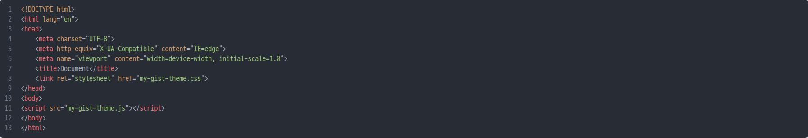
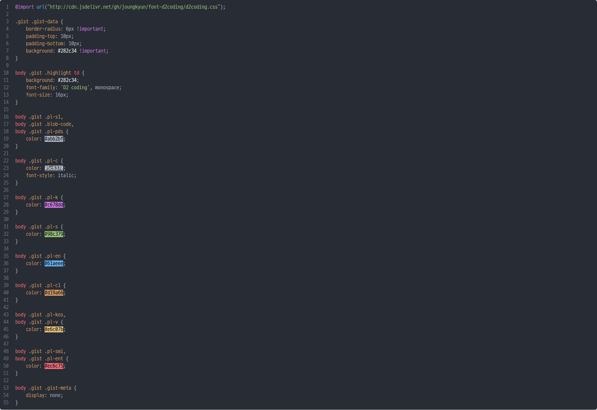
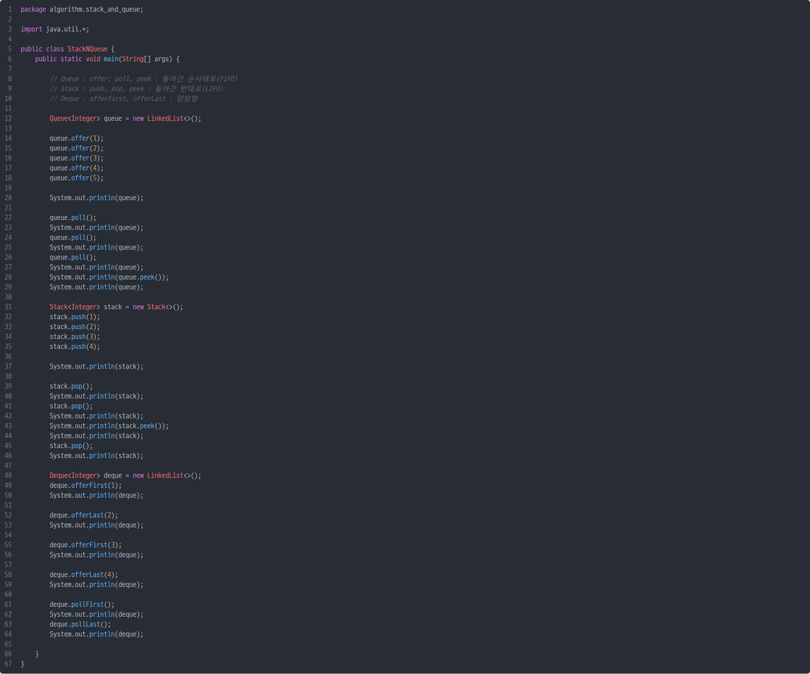
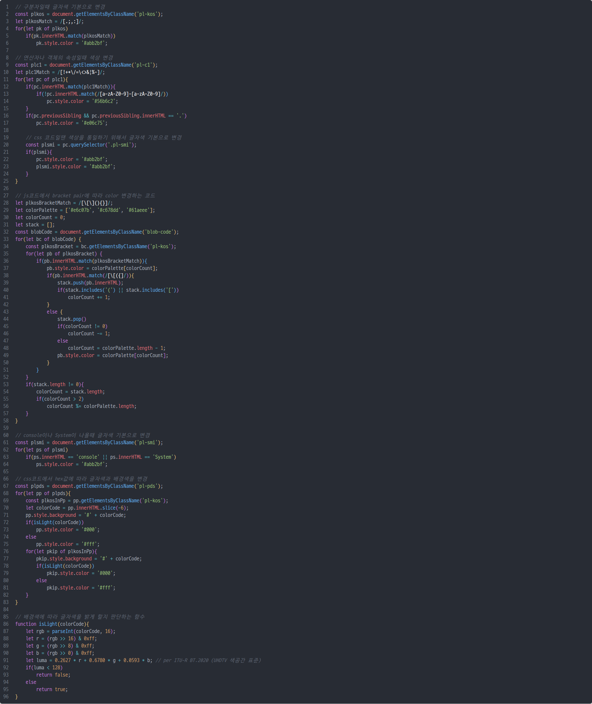
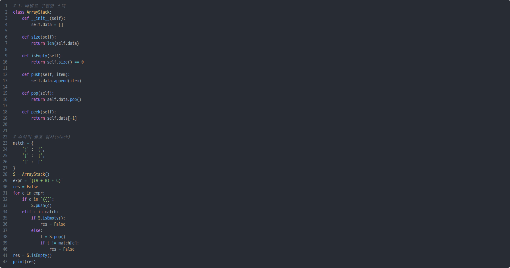

# MY GIST THEME
> :sparkles: notion에 embed할 gist code를 atom-one-dark-theme을 참고해서 유사하게 만든 테마
  
- **Common**
    - gist의 아래 출처를 'display: none'으로 감추고 아래도 똑같이 모서리 rounding을 했다.
- **HTML**
    </img></br>
- **CSS**
    - color hex값을 넣었을 때 배경색을 해당 hex값으로 변경해서 보여준다.
    </img></br>
- **Java**
    </img></br>
- **JS**
    - gist class 분류가 제일 많았기 때문에 js 기준으로 테마를 만들었다.
    - bracket color change 기능을 구현했다.
    </img></br>
- **Python**
  </img></br>

## 사용법
---
아래 코드를 link로 바꿔주는 사이트(https://www.notion-tools.com/embeds/html)를 이용해서 embed하기
``` html
<link rel="stylesheet" type="text/css" href="https://jinspiece.github.io/css/my-gist-theme.css"/>

/* css와 js 사이에 입력하고 싶은 gist script code 입력하기 */

<script src="https://jinspiece.github.io/js/my-gist-theme.js"></script>
```

## 한계점
---
1. 주로 사용하는 마크업 언어나 프로그래밍 언어 환경(html, css, js, python, java)에서만 확인했기 때문에 적용했을 때 예상과 다르게 보일 수 있다. 
2. gist의 클래스 분류 기반으로 적용했기 때문에 같은 코드여도 띄어쓰기로 color 적용이 달라질 수 있다.
    - css에서 'color:'와 'color :'는 다른 class로 분류되기 때문에 이 테마 기준으로는 'color:'로 적용해야 의도대로 보여진다.
3. gist의 클래스 분류 기준이 vscode와 같은 IDE보다 단순하기 때문에 완벽하게 atom-one-dark 테마처럼 적용되진 않는다.